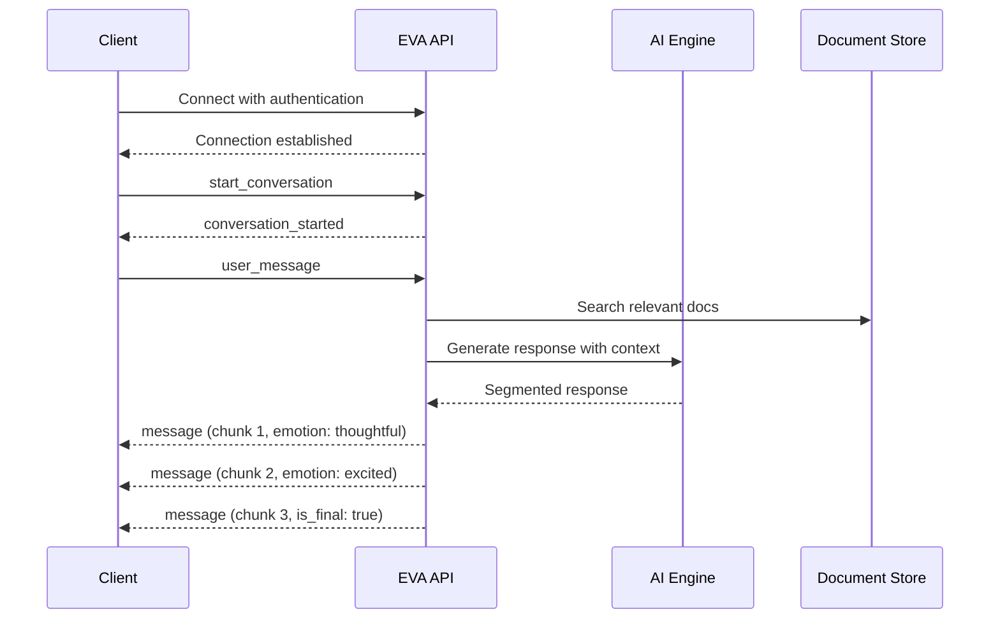

# EVA WebSocket Chat API

Welcome to the EVA WebSocket Chat API documentation. EVA is a real-time chat API service built with WebSocket technology, featuring conversation history, intelligent summarization, and Retrieval-Augmented Generation (RAG) capabilities.

## ✨ Key Features

**Real-time Communication**
: WebSocket-based instant messaging with low latency

**Intelligent Responses**
: AI-powered responses with emotional context and segmented delivery

**Conversation History**
: Persistent storage with automatic summarization for long conversations

**RAG Integration**
: Retrieval-Augmented Generation with automatic document search and source attribution

**Flexible Authentication**
: Multiple authentication methods to suit different platforms and use cases

**Emotional Context**
: Responses include emotional indicators (neutral, happy, excited, thoughtful, etc.) for enhanced user experience

## 🚀 Quick Start

### 1. Get Your API Key

Contact your administrator to obtain your API key for authentication.

### 2. Choose Your Connection Method

=== "JavaScript/Browser"
    ```javascript
    const ws = new WebSocket('ws://your-domain.com/ws', ['chat', 'your-api-key']);
    ```

=== "Python"
    ```python
    import websockets

    extra_headers = {"Authorization": "Bearer your-api-key"}
    ws = await websockets.connect('ws://api.example.com/ws', extra_headers=extra_headers)
    ```

=== "Quick Testing"
    ```bash
    wscat -c "ws://your-domain.com/ws?token=your-api-key"
    ```

### 3. Start Chatting

1. **Connect** to the WebSocket endpoint
2. **Start a conversation** by sending a `start_conversation` message
3. **Send messages** and receive intelligent, emotionally-aware responses
4. **Enjoy** the enhanced conversational experience!

## 📋 Message Flow

The API follows a simple but powerful message flow:



## 🎯 What Makes EVA Special

### Emotional Intelligence

EVA doesn't just respond with text—it provides emotional context that helps create more engaging conversations. Whether the response is `excited` about a discovery or `thoughtful` about a complex topic, you'll know the tone.

### Smart Segmentation

Long responses are intelligently broken into chunks, each with its own emotional context. This allows for progressive display and better user experience.

### Automatic Context

The RAG system automatically searches and incorporates relevant documents into responses, with full source attribution so you know where information comes from.

### Conversation Memory

Every conversation is preserved with intelligent summarization, so context is maintained across sessions without overwhelming the system.

## 🔗 Next Steps

- **New to EVA?** Start with the [Getting Started Guide](getting-started.md)
- **Need technical details?** Check the [API Reference](api-reference.md)
- **Want to see code?** Browse the [Client Examples](client-examples.md)

---

*Ready to build amazing conversational experiences with EVA? Let's get started!*
